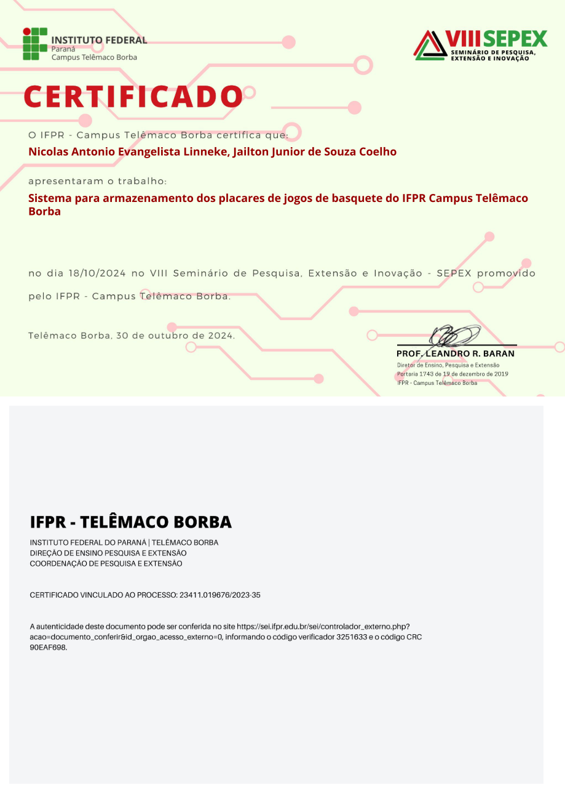

# basketINF
Sistema de armazenamento e organização de placares de jogos de basquete desenvelvido durante o curso técnico.

**Metodologia:** O sistema foi desenvolvido utilizando o **Visual Studio Code**, com as linguagens 
de programação **PHP**, **HTML**, e **SQL**. O trabalho foi conduzido em etapas, incluindo a definição de requisitos, desenvolvimento do banco de dados, implementação do frontend e backend, e testes de funcionalidade.

Foram realizadas conversas com professores e coordenadores para entender as carências do campus
com relação a organização dos jogos. Um banco de dados relacional foi criado utilizando SQL, definindo tabelas para usuários, partidas, resultados e estatísticas. 

**Frontend:** O design das interfaces foi realizado com HTML e PHP, focando na usabilidade e na experiência do usuário.

**Backend:** A lógica de negócios foi programada em PHP, gerenciando a interação entre o banco de dados e as interfaces. 

**Testes:** O sistema foi testado em ambiente local antes da implementação final.

## Apresentação no VIII SEPEX
Este projeto foi apresentado no **VIII Seminário de Pesquisa, Extensão e Inovação (SEPEX)** do IFPR 
Campus Telêmaco Borba no dia 18/10/2024.

## Autores e Orientação
**Desenvolvedor:** Nicolas Antonio Evangelista Linneke

**Orientador:** Prof. Jailton Junior de Souza Coelho

## Próximos Passos (Estudos em Python)
Como atualmente estou focado em aprender e me especializar em **Python**, meus planos futuros para este sistema incluem:
* Migrar o backend atual em PHP para Python (utilizando Flask ou Django).
* Refatorar a estrutura do banco de dados.
* Aplicar os novos conceitos de programação que estou estudando.
